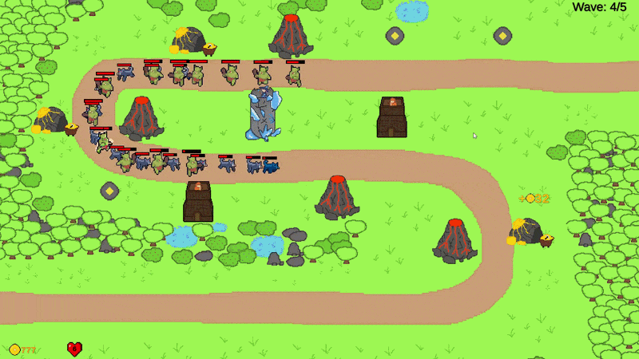

# TDGame
A mini tower defense game made in Unity, including various modular wave, tower and projectile architectures.

Has 5 waves and a complete game loop. The game economy is scaled for a fast-paced, 5-wave prototype experience

Playable WebGL Build: https://eldemirberkay0.itch.io/minitd

  

### Features
* Tower Build/Destroy/Upgrade System
* Modular tower architecture with OOP and scriptable objects
* Easily editable wave and level datas via inspector with scriptable objects based structure
* Object pooler for enemies and projectiles etc.
